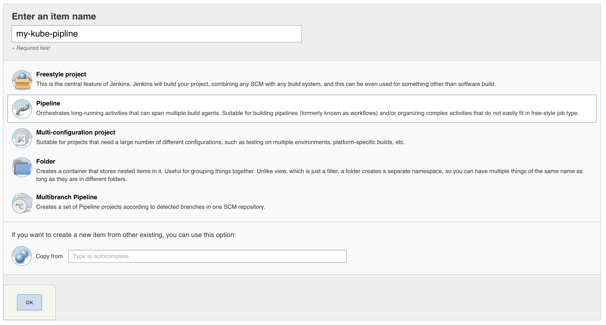
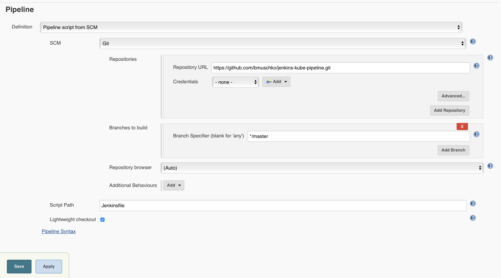
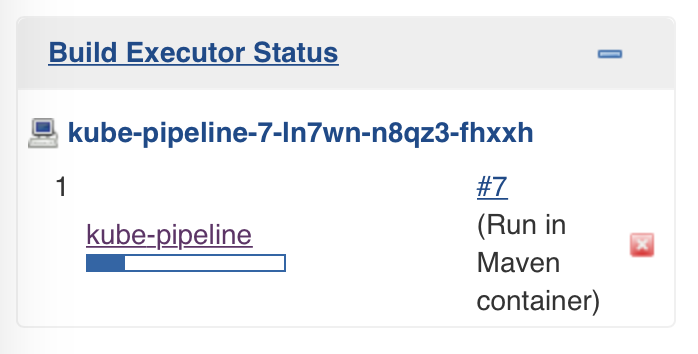

# Containerized Pipeline Steps

* Prerequisite: Set up Jenkins with the help of the Kubernetes plugin [as described here](../on-demand-agents/README.md)
* Pipeline steps can run with default container defined with the Kubernetes plugin
* For more specialized operations, an individualized container can be specified

## Setting up the repository

* Create a new Git repository
* Add a `Jenkinsfile` and define the pipeline
* The pipeline uses the elements for running a build step in a container (as provided by the Kubernetes plugin)
* Define a default container in case a build step doesn't define a container

## Setting up the Jenkins project

* Create a new item
* Enter a name and select "Pipeline"

* Select "Pipeline from SCM" and point it to the Git repository
* Click the "OK" button

## Running the Jenkins project

* Manually trigger a build
* The job will show up in the build queue
* Kubernetes will take a couple of seconds to provision the Pod and the containers running in it

* The job will be executed inside of a Pod
* Build stages are indicated by their name

